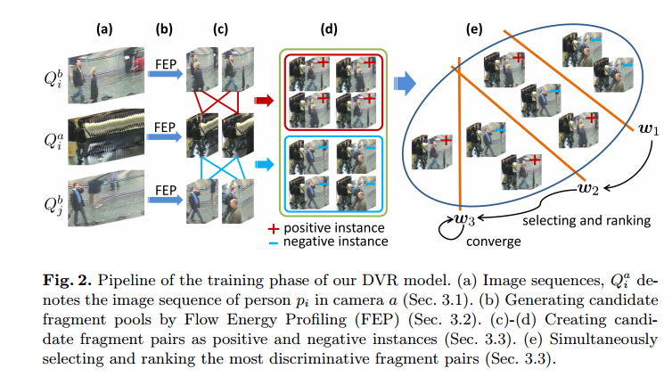

# 2014
       
|No.|Figure   |Title   |features | Results  |Pub.  |Links|
|:-----:|:-----:|:-----:|:-----:|:---:|:---:|:------:|
|1||__Person Re-identification by Video Ranking__|HOG3D|iLIDS-VID(Rank1=28.9%) PRID(Rank1=23.3%)|__ECCV2014__|[`paper`](http://www.eecs.qmul.ac.uk/~sgg/papers/WangEtAl_ECCV14.pdf)|