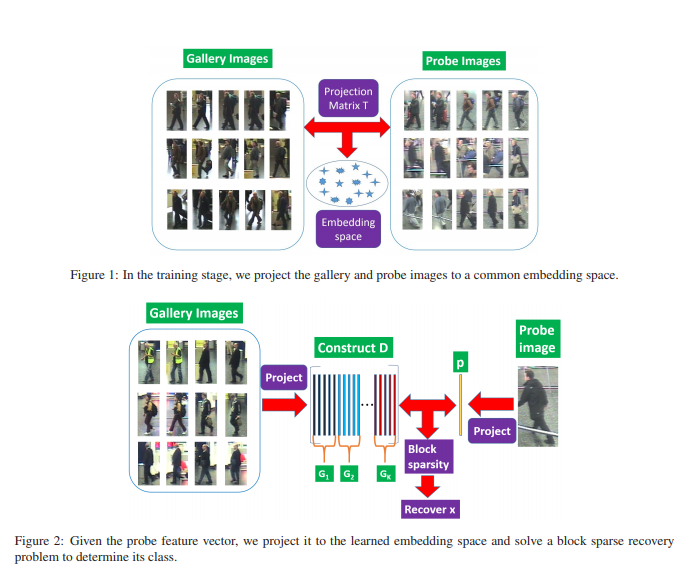
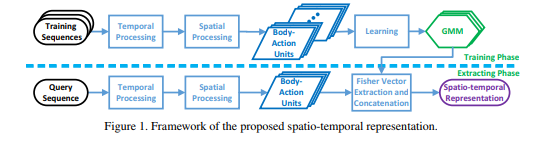

# 2015

                             
|No.|Figure   |Title   |features | Results  |Pub.  |Links|
|:-----:|:-----:|:-----:|:-----:|:---:|:---:|:------:|
|1||__Sparse Re-ID: Block Sparsity for Person Re-identification__|Color Histograms Schmid & Gabor Filters|iLIDS-VID(Rank1=24.9%) PRID(Rank1=35.1%)|__CVPR2015__|[paper](http://openaccess.thecvf.com/content_cvpr_workshops_2015/W14/papers/Karanam_Sparse_Re-Id_Block_2015_CVPR_paper.pdf)|
|2||__A Spatio-temporal Appearance Representation for Video-based Pedestrian Re-identification__|Fiser vector|iLIDS-VID(Rank1= 44.3%) PRID(Rank1=64.1%)|__ICCV2015__|[paper](https://ieeexplore.ieee.org/stamp/stamp.jsp?tp=&arnumber=7410791)|