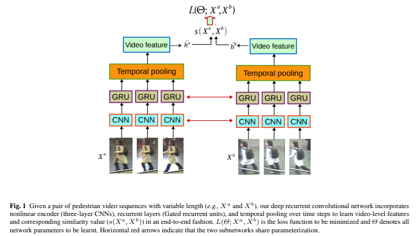
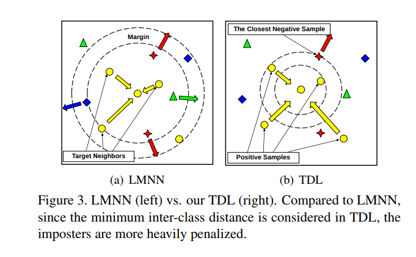
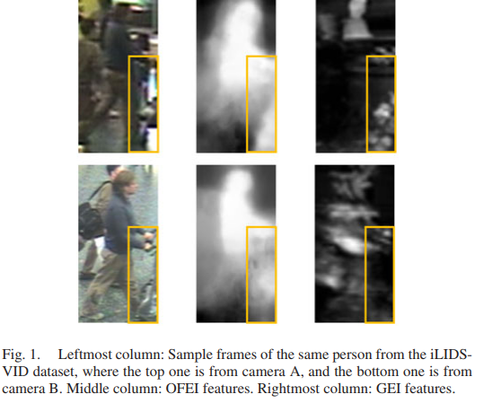
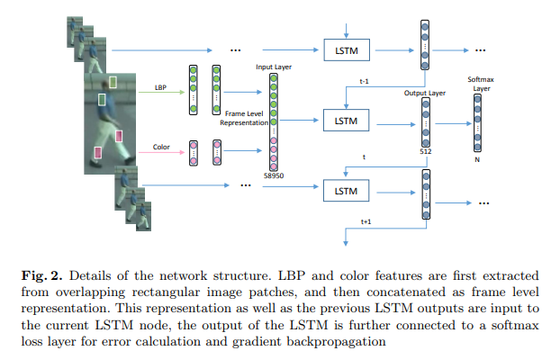
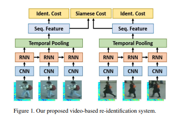

# 2016

                             
|No.|Figure   |Title   |features | Results  |Pub.  |Links|
|:-----:|:-----:|:-----:|:-----:|:---:|:---:|:------:|
|1||__Deep Recurrent Convolutional Networks for Video-based Person Re-identification: An End-to-End Approach__|four CNN（四层卷积神经网络）|iLIDS-VID(Rank1=42.6%) PRID(Rank1=49.8%)|__arxiv2016__|[paper](https://arxiv.org/pdf/1606.01609.pdf)|
|2||__Top-push Video-based Person Re-identification__|HOG3D + color histograms + LBP|iLIDS-VID(Rank1=56.33%) PRID(Rank1=56.74%)|__CVPR 2016__|[paper](https://arxiv.org/pdf/1604.08683.pdf)|
|3||__Person Re-identification by Exploiting Spatio-temporal Cues and Multi-view Metric Learning__|LBP|iLIDS-VID(Rank1=69.13%) PRID(Rank1=66.78%)|__IEEE SRL 2016__|[paper](https://ieeexplore.ieee.org/stamp/stamp.jsp?arnumber=7480858)|
|4||__Person Re-identification via Recurrent Feature Aggregation__|LBP+HSV+lab color channels|iLIDS-VID(Rank1=49.3%) PRID(Rank1=64.1%)|__ECCV2016__|[paper](https://arxiv.org/pdf/1701.06351.pdf) [code](https://github.com/daodaofr/caffe-re-id)|
|5||__Recurrent Convolutional Network for Video-based Person Re-identification__|CNN + RNN  (非常经典的结构)|iLIDS-VID(Rank1=58%) PRID(Rank1=70%)|__CVPR2016__|[paper](https://www.cv-foundation.org/openaccess/content_cvpr_2016/papers/McLaughlin_Recurrent_Convolutional_Network_CVPR_2016_paper.pdf) [code](https://github.com/niallmcl/Recurrent-Convolutional-Video-ReID)|