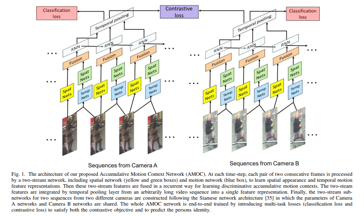
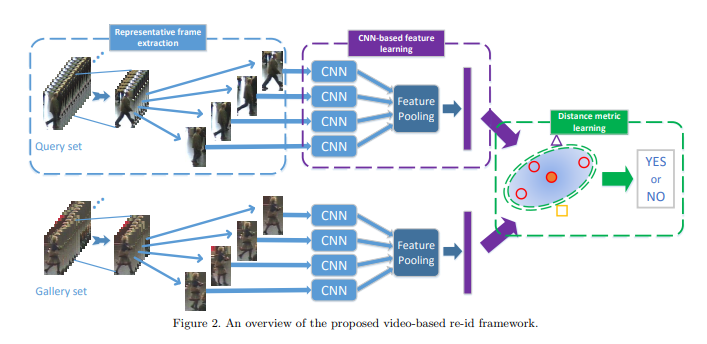
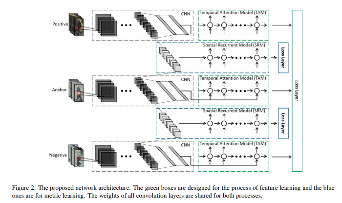
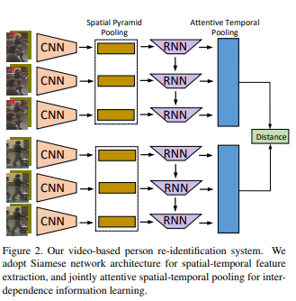
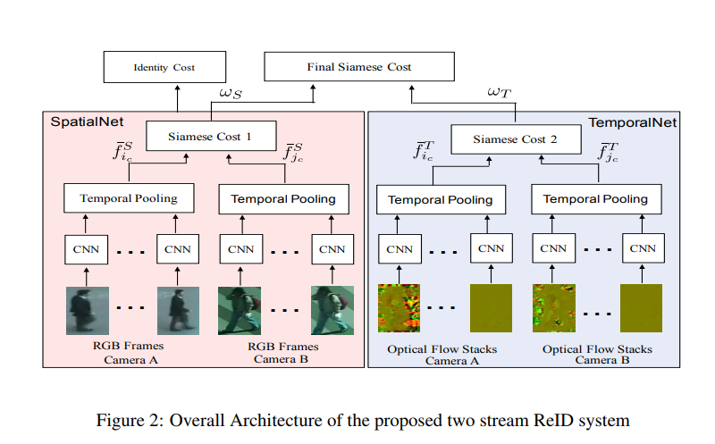
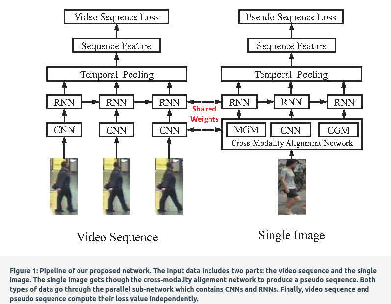
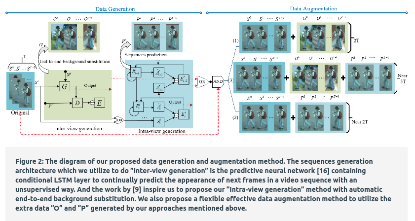
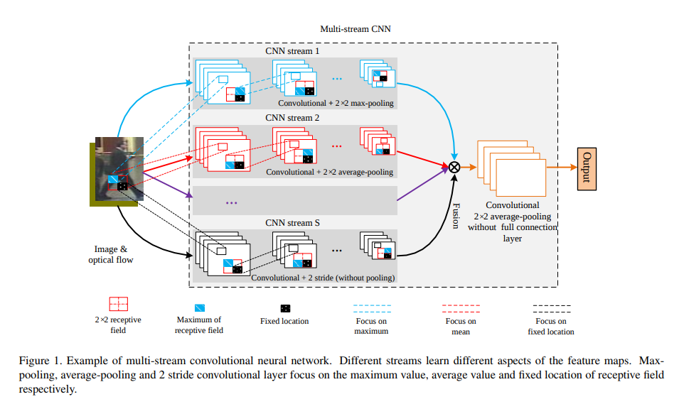

# 2017                                                        
  
                             
|No.|Figure   |Title   |features | Results  |Pub.  |Links|
|:-----:|:-----:|:-----:|:-----:|:---:|:---:|:------:|
|1||__Video-based Person Re-identification with Accumulative Motion Contex__|CNN + RNN + opticflow|iLIDS-VID(Rank1=65.3%) PRID(Rank1=78%)|__TCSVT2017__|[paper](https://arxiv.org/pdf/1701.00193.pdf)|
|2||__Learning Compact Appearance Representation for Video-based Person Re-identification__|Five CNN (5层卷积神经网络)|iLIDS-VID(Rank1=60.4%) PRID(Rank1=83.3%)|__arxiv2017__|[paper](https://arxiv.org/pdf/1702.06294.pdf)|
|3||__See the Forest for the Trees: Joint Spatial and Temporal Recurrent Neural Networks for Video-based Person Re-identification__|Temporal Attention Model (TAM) + Spatial Recurrent Model (SRM)|iLIDS-VID(Rank1=55.2%) PRID(Rank1=79.4%) Mars(Rank1=70.6%,mAp=50.7)|__CVPR2017__|[paper](http://openaccess.thecvf.com/content_cvpr_2017/papers/Zhou_See_the_Forest_CVPR_2017_paper.pdf)|
|4||__Quality Aware Network for Set to Set Recognition__|CNN(GoogleNet)|iLIDS-VID(Rank1=68.0%) PRID(Rank1=90.3 %)|__CVPR2017__|[paper](http://openaccess.thecvf.com/content_cvpr_2017/papers/Liu_Quality_Aware_Network_CVPR_2017_paper.pdf) [code](https://github.com/sciencefans/Quality-Aware-Network)|
|5||__Jointly Attentive Spatial-Temporal Pooling Networks for Video-based Person Re-identification__|(3层)CNN + RNN + attention|iLIDS-VID(Rank1=62%) PRID(Rank1=77%) Mars(Rank1=44%)|__ICCV2017__|[paper](https://arxiv.org/pdf/1708.02286.pdf) [code](https://github.com/shuangjiexu/Spatial-Temporal-Pooling-Networks-ReID)|
|6||__A Two Stream Siamese Convolutional Neural Network For Person Re-identification__|CNN + RNN + attention  => (siamese network)|iLIDS-VID(Rank1=60%) PRID(Rank1=78%)|__ICCV2017__|[paper](http://openaccess.thecvf.com/content_ICCV_2017/papers/Chung_A_Two_Stream_ICCV_2017_paper.pdf)|
|7||__Deep Cross-Modality Alignmeant for Multi-Shot Person Re-Identification__|(3层)CNN + RNN + avgpooling|iLIDS-VID(Rank1=67.5%) PRID(Rank1=80%) Mars(Rank1=63%)|__MM2017__|[paper](https://dl.acm.org/citation.cfm?id=3123266.3123324)|
|8||__Data Generation for Improving Person Re-identification__|(3层)CNN + RNN + avgpooling|iLIDS-VID(Rank1=66%) PRID(Rank1=79%)|__MM2017__|[paper](https://dl.acm.org/citation.cfm?id=3123302)|
|9||__Three-Stream Convolutional Networks for Video-based Person Re-Identification__|(4层)CNN + RNN + avgpooling|iLIDS-VID(Rank1=67.5%) PRID(Rank1=79.7%) Mars(Rank1=45.6%)|__arxiv2017__|[paper](https://arxiv.org/pdf/1712.01652.pdf)|
