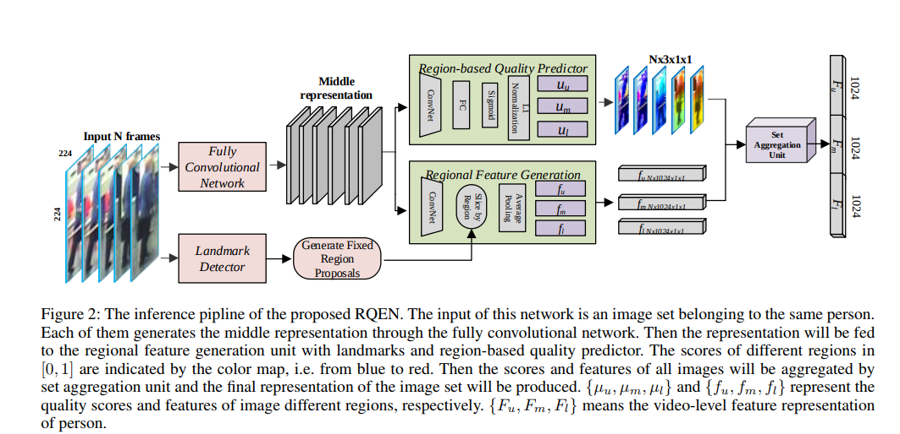
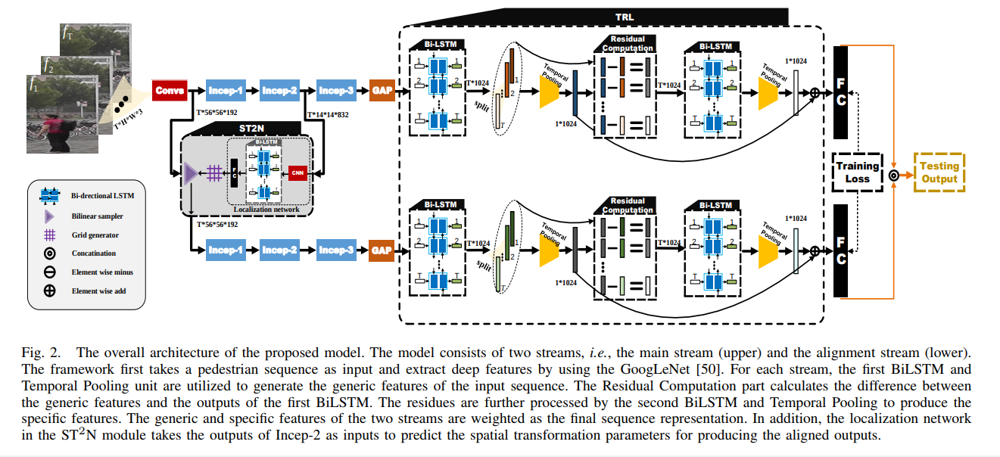
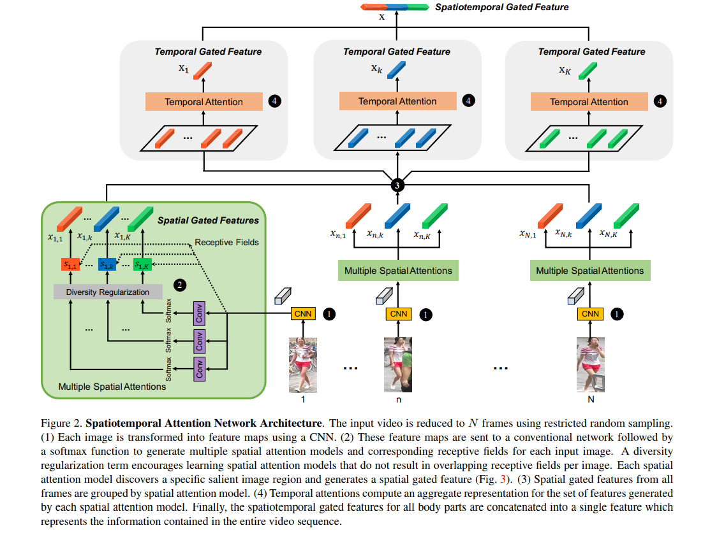
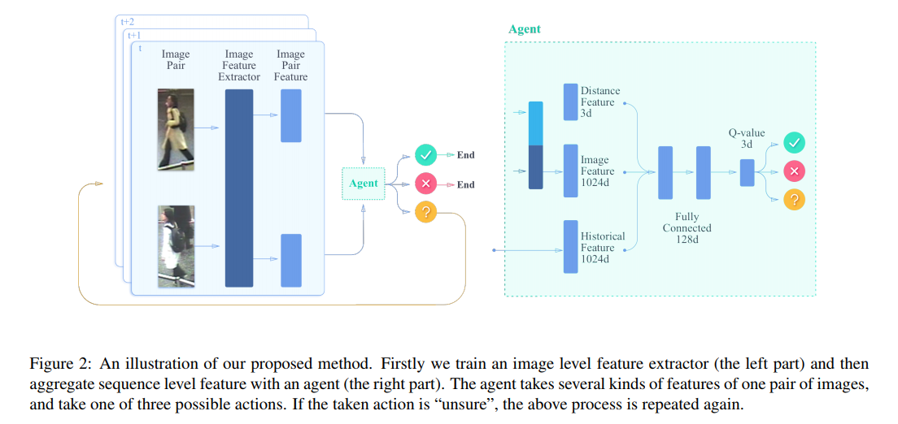
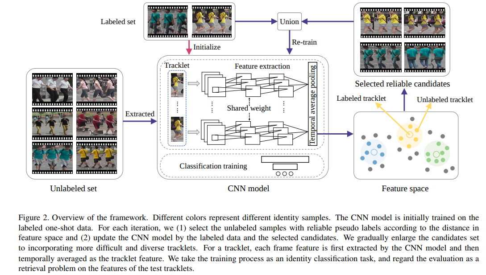
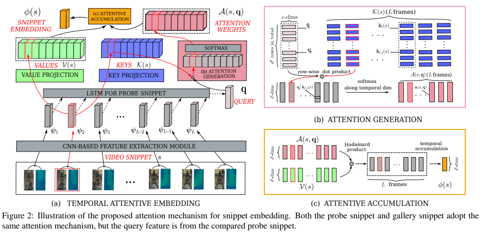
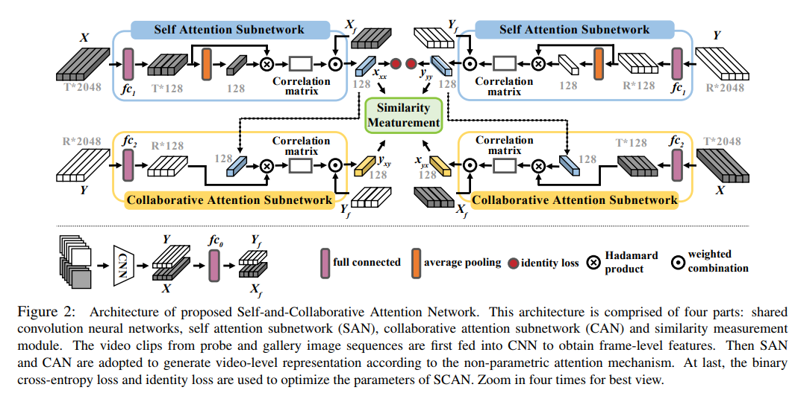
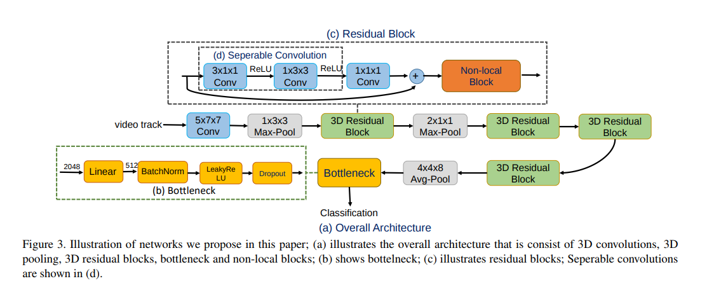
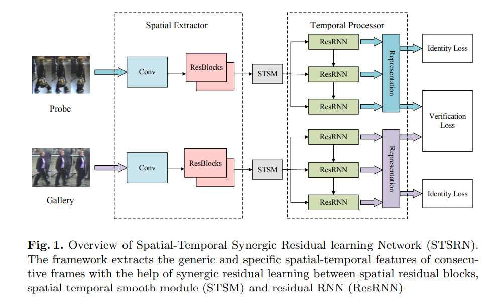

# 2018    

                             
|No.|Figure   |Title   |features | Results  |Pub.  |Links|
|:-----:|:-----:|:-----:|:-----:|:---:|:---:|:------:|
|1||__Region-based Quality Estimation Network for Large-scale Person Re-identification__|(4层)CNN + RNN + avgpooling|iLIDS-VID(Rank1=76.1%) PRID(Rank1=92.4%) Mars(Rank1=77.83%,mAP=71.14%)|__AAAI2018__|[paper](https://arxiv.org/pdf/1711.08766.pdf)|
|2||__Video Person Re-identification by Temporal Residual Learning__|GoogleNet + BiLSTM|iLIDS-VID(Rank1=57.7%) PRID(Rank1=87.8%) Mars=(Rank1=79.3%)|__arxiv2018__|[paper](https://arxiv.org/pdf/1802.07918.pdf)|
|3||__Diversity Regularized Spatiotemporal Attention for Video-based Person Re-identification__|Resnet50 + attention|iLIDS-VID(Rank1=80.2%) PRID(Rank1=93.2%) Mars(Rank1=82.3%,mAP=65.8%)|__CVPR2018__|[paper](https://arxiv.org/pdf/1803.09882.pdf) [code](https://github.com/ShuangLI59/Diversity-Regularized-Spatiotemporal-Attention)|
|4||__Multi-shot Pedestrian Re-identification via Sequential Decision Making__|Inception-BN or AlexNet|iLIDS-VID(Rank1=60.2%) PRID(Rank1=85.2%) Mars=(Rank1=71.2%)|__CVPR2018__|[paper](https://arxiv.org/pdf/1712.07257.pdf) [code](https://github.com/TuSimple/rl-multishot-reid)|
|5||__Exploit the Unknown Gradually: One-Shot Video-Based Person Re-Identification by Stepwise Learning__|ResNet50 + avgpooling|Mars(Rank1=62.67%,mAP=42.45%) DukeMTMC-VideoReID(Rank1=72.79%,mAp=63.23%)|__CVPR2018__|[paper](https://yu-wu.net/pdf/CVPR2018_Exploit-Unknown-Gradually.pdf) [code](https://github.com/Yu-Wu/Exploit-Unknown-Gradually)|
|6||__Video Person Re-identification with Competitive Snippet-similarity Aggregation and Co-attentive Snippet Embedding__|ResNet50 + attention|iLIDS-VID(Rank1=85.4%,mAP=87.8%) PRID(Rank1=93.0%,mAP=94.5%) Mars(Rank1=86.3%,mAP=76.1%)|__CVPR2018__|[paper](http://openaccess.thecvf.com/content_cvpr_2018/CameraReady/1036.pdf) [code](https://github.com/dapengchen123/video_reid)|
|7||__SCAN: Self-and-Collaborative Attention Network for Video Person Re-identification__|ResNet50 + attention|iLIDS-VID(Rank1=88.0%,mAP=89.9%) PRID(Rank1=95.3%,mAP=95.8%) Mars(Rank1=87.2%,mAP=77.2%)|__CVPR2018__|[paper](https://arxiv.org/pdf/1807.05688.pdf)|
|8||__Video-based Person Re-identification via 3D Convolutional Networks and Non-local Attention__|ResNet50-3D + avgpooling|iLIDS-VID(Rank1=81.3%) PRID(Rank1=91.2%) Mars(Rank1=84.3%,mAP=77%)|__arxiv2018__|[paper](https://arxiv.org/pdf/1807.05073.pdf)|
|9||__Spatial-Temporal Synergic Residual Learning for Video Person Re-Identification__|CNN + RNN + avgpooling|iLIDS-VID(Rank1=70%) PRID(Rank1=88%) Mars(Rank1=76.7%)|__arxiv2018__|[paper](https://arxiv.org/pdf/1807.05799.pdf)|
