# 2019   

                             
|No.|Figure   |Title   |features | Results  |Pub.  |Links|
|:-----:|:-----:|:-----:|:-----:|:---:|:---:|:------:|
|1|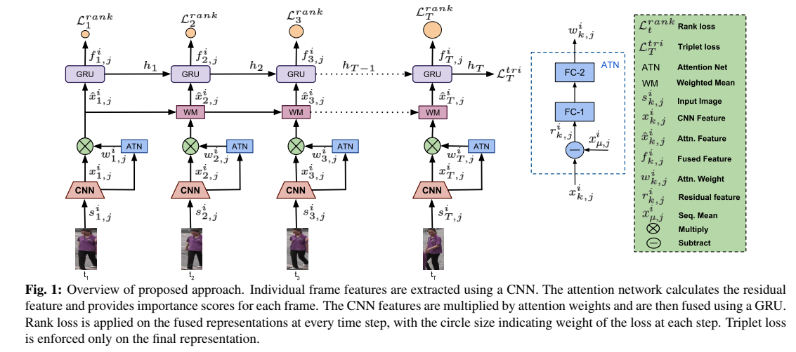|__All for One: Frame-wise Rank Loss for Improving Video-based Person Re-identification__|Resnet50 + GRU + Rankloss|PRID(Rank1=75.17%) Mars(Rank1=77.27%,mAP=64.76%)|__ICASSP2019__|[paper](https://ieeexplore.ieee.org/stamp/stamp.jsp?tp=&arnumber=8682292)|
|2|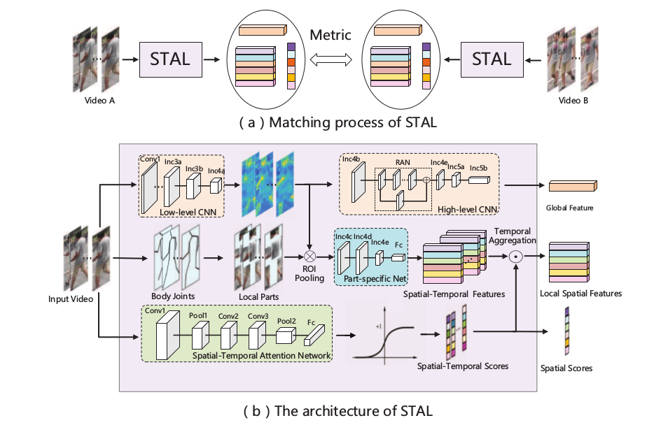|__Spatial-Temporal Attention-aware Learning for Video-based Person Re-identification__|GoogleNet + STAL|iLIDS-VID(Rank1=82.8%) PRID(Rank1=92.7%) Mars(Rank1=82.2%,mAP=73.5%)|__ITIP2019__|[paper](https://ieeexplore.ieee.org/stamp/stamp.jsp?tp=&arnumber=8675957)|
|3|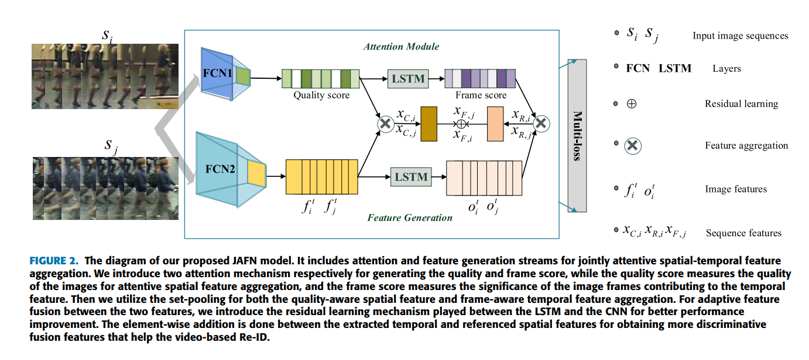|__Joint Attentive Spatial-Temporal Feature Aggregation for Video-Based Person Re-Identification__|FCN + attention|iLIDS-VID(Rank1=76%) PRID(Rank1=97.4%) Mars(Rank1=89.3%,mAP=74.9%)|__IEEE Access__|[paper](https://ieeexplore.ieee.org/stamp/stamp.jsp?tp=&arnumber=8675282)|
|4|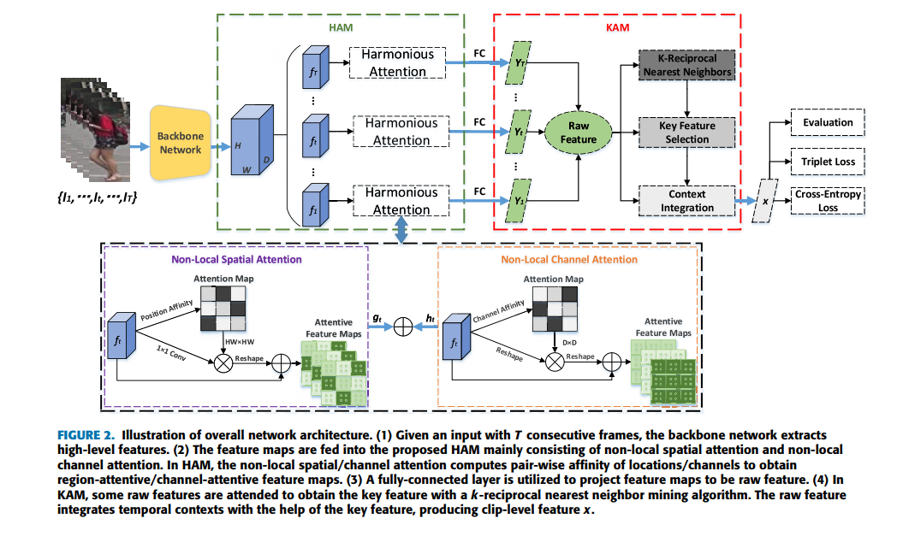|__k-Reciprocal Harmonious Attention Network for Video-Based Person Re-Identification__|Resnet50 + Attention|iLIDS-VID(Rank1=80.3%) PRID(Rank1=90.0%) Mars(Rank1=84.9%,mAp=76.7%)|__IEEE Access__|[paper](https://ieeexplore.ieee.org/stamp/stamp.jsp?tp=&arnumber=8643936)|
|5|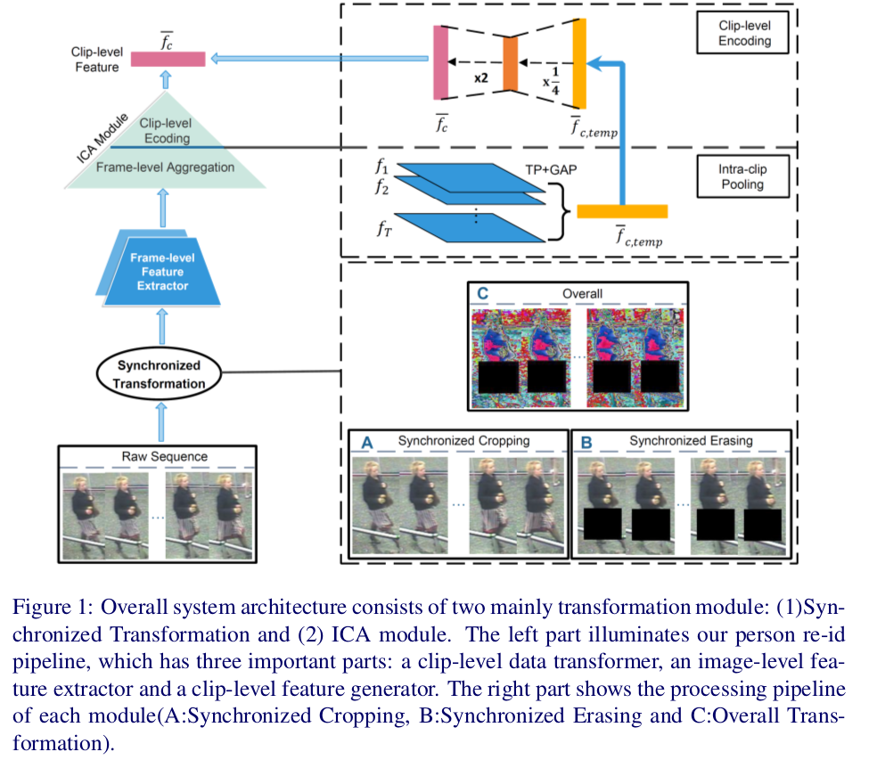|__Intra-clip Aggregation for Video Person Re-identification__|Resnet50 + Synchronized Transformation (ST) and Intra-clip Aggregation (ICA)|iLIDS-VID(Rank1=88.7%) Mars(Rank1=86.0%,mAP=80.8%)|__Arxiv 2019__|[paper](https://arxiv.org/abs/1905.01722.pdf)|
|6|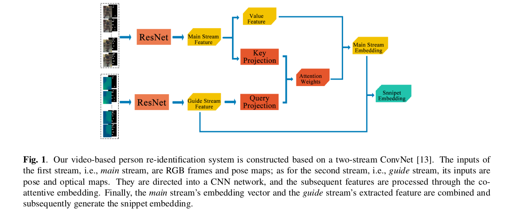|__Video-based Person Re-identification with Two-stream Convolutional Network and Co-attentive Snippet Embedding__|Resnet50 + Attention + Pose and Optical map|iLIDS-VID(Rank1=88.7%) PRID(Rank1=94.4%)|__Arxiv 2019__|[paper](https://arxiv.org/pdf/1905.11862.pdf)|
|7|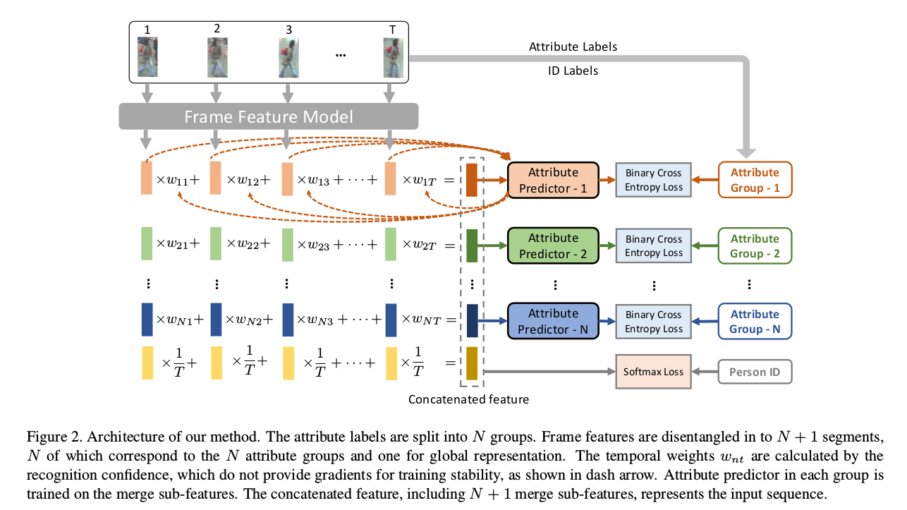|__Attribute-Driven Feature Disentangling and Temporal Aggregation for Video Person Re-Identification__|Resnet50 + attribute learning|iLIDS-VID(Rank1=86.3%) PRID(Rank1=93.9%) Mars(Rank1=82.6%,mAP=71.2%)|__CVPR2019__|[paper](http://openaccess.thecvf.com/content_CVPR_2019/papers/Zhao_Attribute-Driven_Feature_Disentangling_and_Temporal_Aggregation_for_Video_Person_Re-Identification_CVPR_2019_paper.pdf)|
|8|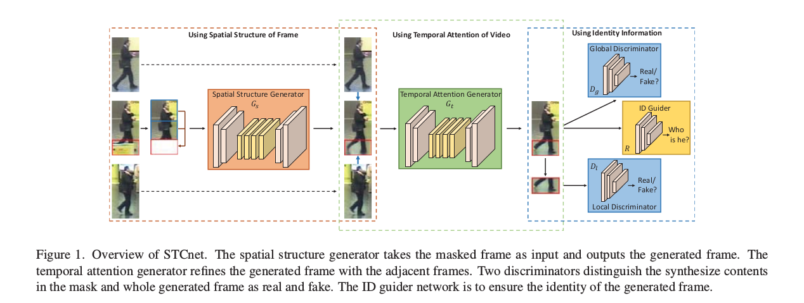|__VRSTC: Occlusion-Free Video Person Re-Identification__|Resnet50 + Attention + GAN|iLIDS-VID(Rank1=83.4%) Mars(Rank1=88.5%,mAP=82.3%) DukeMTMC(Rank1=95.0%,mAP=93.5%)|__CVPR2019__|[paper](http://openaccess.thecvf.com/content_CVPR_2019/papers/Hou_VRSTC_Occlusion-Free_Video_Person_Re-Identification_CVPR_2019_paper.pdf)|
|9|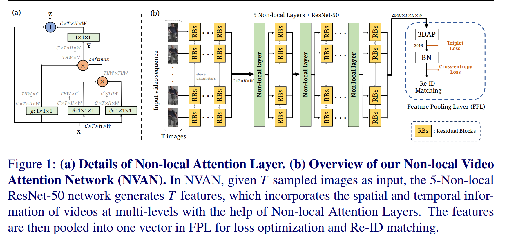|__Spatially and Temporally Efficient Non-local Attention Network for Video-based Person Re-Identification__|Resnet50 + Non-Local|Mars(Rank1=90%,mAP=82.8%) DukeMTMC(Rank1=96.3%,mAP=94.9%)|__BMVC2019__|[paper](https://arxiv.org/pdf/1908.01683.pdf) [code](https://github.com/jackie840129/STE-NVAN)|
|10|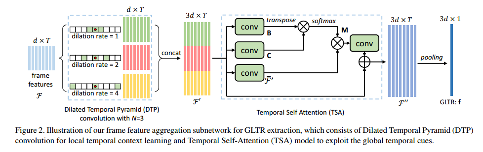|__Global-Local Temporal Representations For Video Person Re-Identification__|Resnet50 + parallel dilated convolutions + temporal self-attention|Mars(Rank1=87.02%,mAP=78.47%) DukeMTMC(Rank1=96.29%,mAP=93.74%) iLIDS-VID(Rank1=86.0%) PRID(Rank1=95.5%) **LS-VID**(Rank1=63.07%,mAP=44.32%)|__ICCV2019__|[paper](https://arxiv.org/pdf/1908.10049.pdf)|
|11|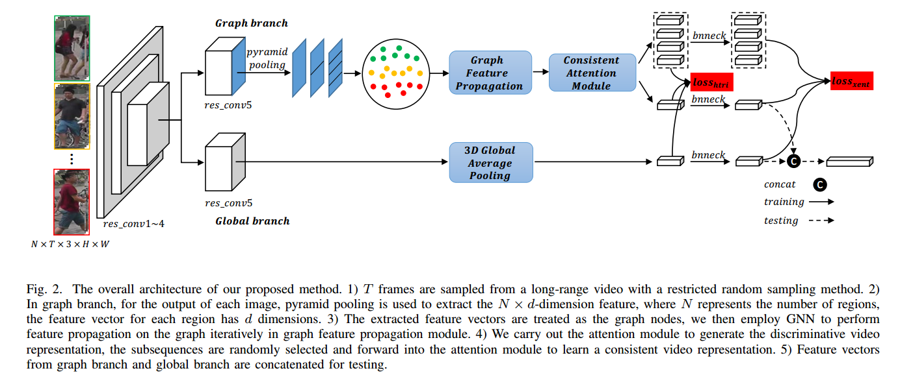|__Adaptive Graph Representation Learning for Video Person Re-identification__|Resnet50 + pose alignment  + GNN|Mars(Rank1=89.8%,mAP=81.1%) DukeMTMC(Rank1=97.0%,mAP=95.4%) iLIDS-VID(Rank1=84.5%) PRID(Rank1=94.6%) |__IEEE TIP__|[paper](https://arxiv.org/pdf/1909.02240.pdf)|
|12|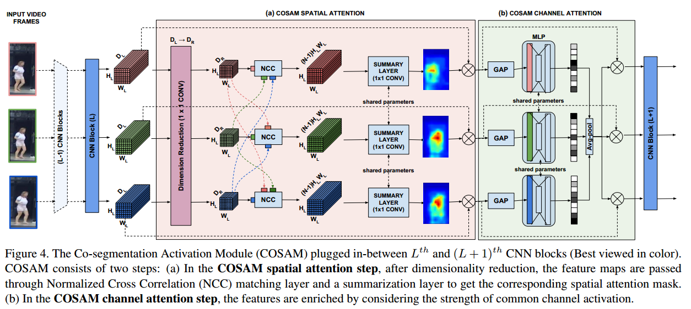|__Co-Segmentation Inspired Attention Networks for Video-Based Person Re-Identification__|SE-Resnet50 + Cosegmentation based Attention Module(COSAM)|Mars(Rank1=84.9%,mAP=79.9%) DukeMTMC(Rank1=95.4%,mAP=94.1%) iLIDS-VID(Rank1=79.61%) |__ICCV2019__|[paper](http://openaccess.thecvf.com/content_ICCV_2019/papers/Subramaniam_Co-Segmentation_Inspired_Attention_Networks_for_Video-Based_Person_Re-Identification_ICCV_2019_paper.pdf)|
