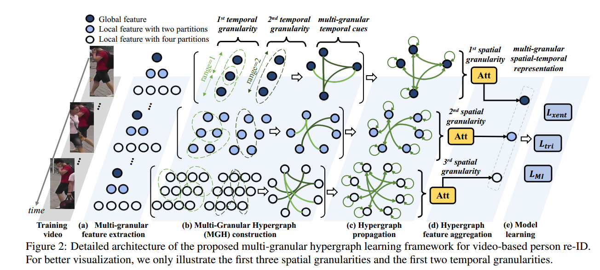
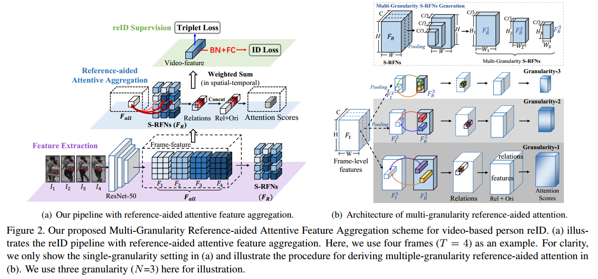
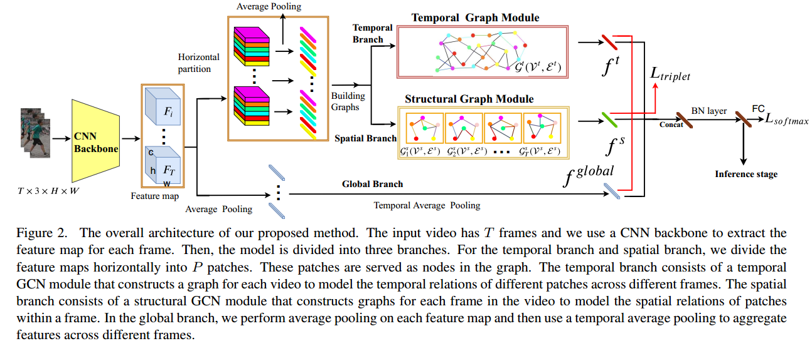

# 2020   

                             
|No.|Figure   |Title   |features | Results  |Pub.  |Links|
|:-----:|:-----:|:-----:|:-----:|:---:|:---:|:------:|
|1||__Learning Multi-Granular Hypergraphs for Video-Based Person Re-Identification__|Resnet50 + Multi-Granular Hypergraphs + mutual information minimization|PRID(Rank1=94.8%) iLIDS-VID(Rank1=85.6%) Mars(Rank1=90.0%,mAP=85.8%)|__CVPR2020__|[paper](https://openaccess.thecvf.com/content_CVPR_2020/papers/Yan_Learning_Multi-Granular_Hypergraphs_for_Video-Based_Person_Re-Identification_CVPR_2020_paper.pdf)|
|2||__Multi-Granularity Reference-Aided Attentive Feature Aggregation for Video-based Person Re-identification__|Resnet50 + Multi-Granularity Attention|PRID(Rank1=95.9%) iLIDS-VID(Rank1=88.6%) Mars(Rank1=88.8%,mAP=85.9%)|__CVPR2020__|[paper](https://arxiv.org/pdf/2003.12224.pdf)|
|3||__Spatial-Temporal Graph Convolutional Network for Video-based Person Re-identification__|Resnet50 + Spatial GCN + Temporal GCN|DukeMTMC(Rank1=97.29%,mAP=95.7%) Mars(Rank1=89.95%,mAP=83.7%)|__CVPR2020__|[paper](https://openaccess.thecvf.com/content_CVPR_2020/papers/Yang_Spatial-Temporal_Graph_Convolutional_Network_for_Video-Based_Person_Re-Identification_CVPR_2020_paper.pdf)|

