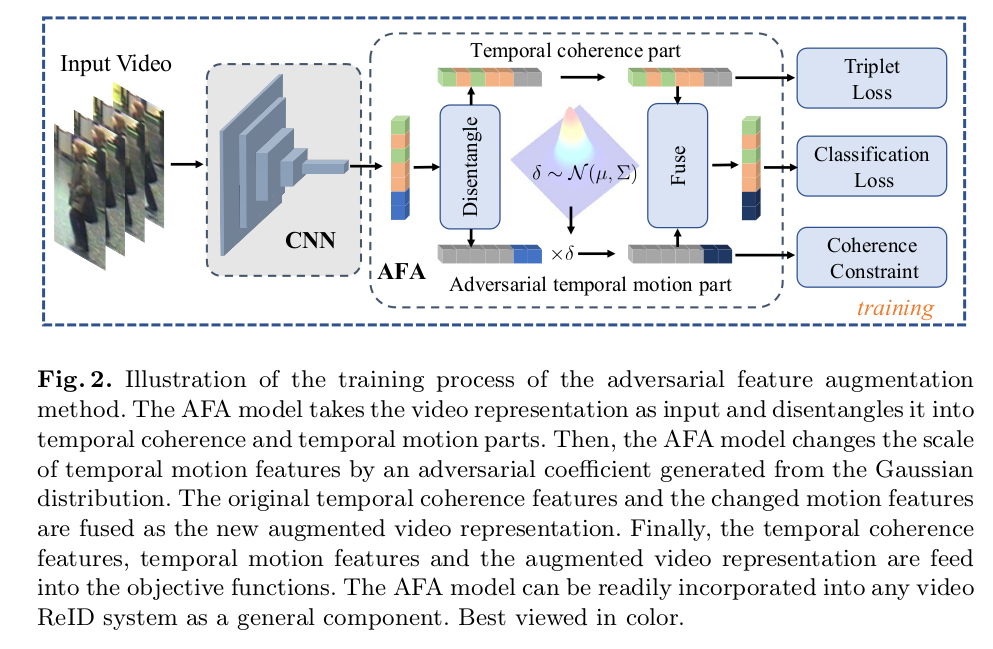
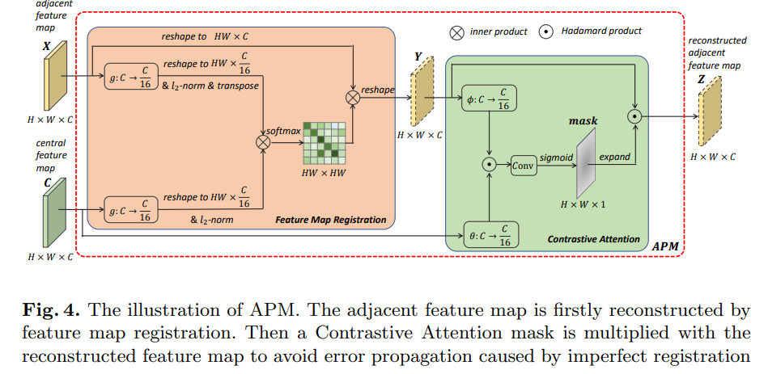
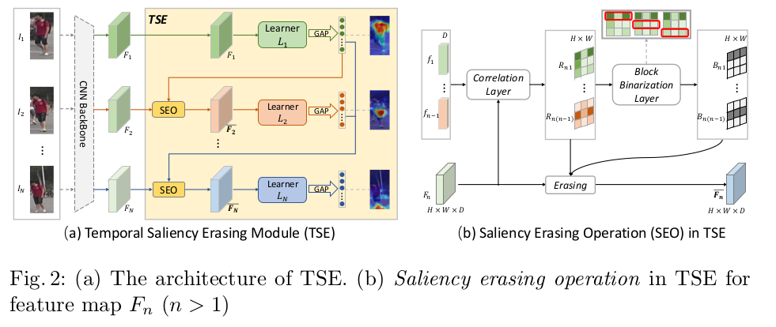

# 2020   

                             
|No.|Figure   |Title   |features | Results  |Pub.  |Links|
|:-----:|:-----:|:-----:|:-----:|:---:|:---:|:------:|
|1||__Learning Multi-Granular Hypergraphs for Video-Based Person Re-Identification__|Resnet50 + Multi-Granular Hypergraphs + mutual information minimization|PRID(Rank1=94.8%) iLIDS-VID(Rank1=85.6%) Mars(Rank1=90.0%,mAP=85.8%)|__CVPR2020__|[paper](https://openaccess.thecvf.com/content_CVPR_2020/papers/Yan_Learning_Multi-Granular_Hypergraphs_for_Video-Based_Person_Re-Identification_CVPR_2020_paper.pdf)|
|2||__Multi-Granularity Reference-Aided Attentive Feature Aggregation for Video-based Person Re-identification__|Resnet50 + Multi-Granularity Attention|PRID(Rank1=95.9%) iLIDS-VID(Rank1=88.6%) Mars(Rank1=88.8%,mAP=85.9%)|__CVPR2020__|[paper](https://arxiv.org/pdf/2003.12224.pdf)|
|3||__Spatial-Temporal Graph Convolutional Network for Video-based Person Re-identification__|Resnet50 + Spatial GCN + Temporal GCN|DukeMTMC(Rank1=97.29%,mAP=95.7%) Mars(Rank1=89.95%,mAP=83.7%)|__CVPR2020__|[paper](https://openaccess.thecvf.com/content_CVPR_2020/papers/Yang_Spatial-Temporal_Graph_Convolutional_Network_for_Video-Based_Person_Re-Identification_CVPR_2020_paper.pdf)|
|4||__Temporal Coherence or Temporal Motion:Which is More Critical for Video-based PersonRe-identification?__|Resnet50 + Adversarial Feature Augmentation (AFA) method|DukeMTMC(Rank1=97.2%,mAP=95.4%) Mars(Rank1=90.2%,mAP=82.9%) iLIDS-VID(Rank1=88.5%)|__ECCV2020__|[paper](https://raoyongming.github.io/files/temporal_coherence.pdf)|
|5||__Appearance-Preserving 3D Convolution for Video-based Person Re-identification__|Resnet50-3dconv + Appearance-Preserving Module(APM)|DukeMTMC(Rank1=96.3%,mAP=95.6%) Mars(Rank1=90.1%,mAP=85.1%) |__ECCV2020__|[paper](https://arxiv.org/pdf/2007.08434.pdf) [code](https://github.com/guxinqian/AP3D)|
|5||__Temporal Complementary Learning for Video Person Re-Identification__|Resnet50 + Temporal Saliency Erasing (TSE) module + Temporal Saliency Boosting (TSB) module|DukeMTMC(Rank1=96.9%,mAP=96.2%) Mars(Rank1=89.8%,mAP=85.1%) iLIDS-VID(Rank1=86.6%)|__ECCV2020__|[paper](https://arxiv.org/pdf/2007.09357.pdf) [code](https://github.com/blue-blue272/VideoReID-TCLNet)|

