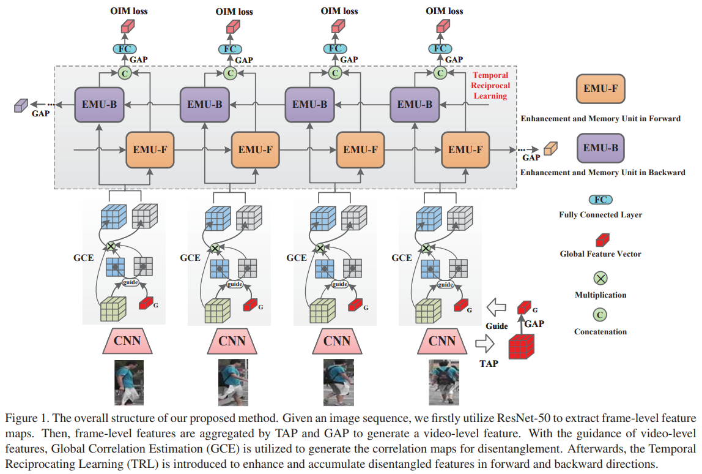
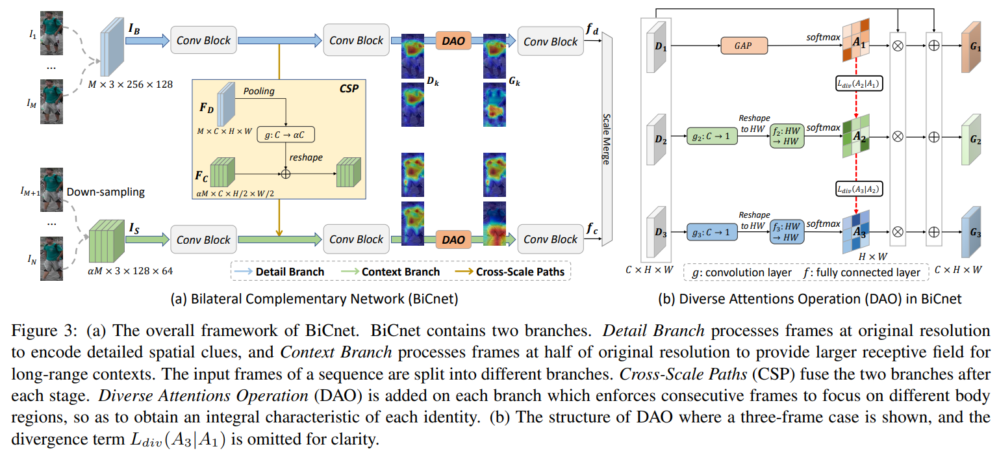
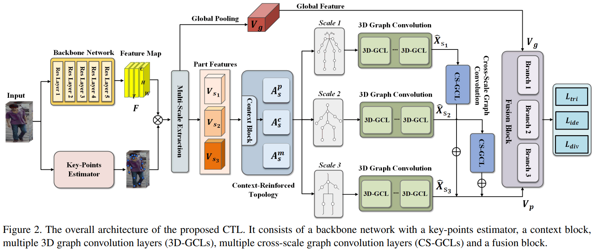
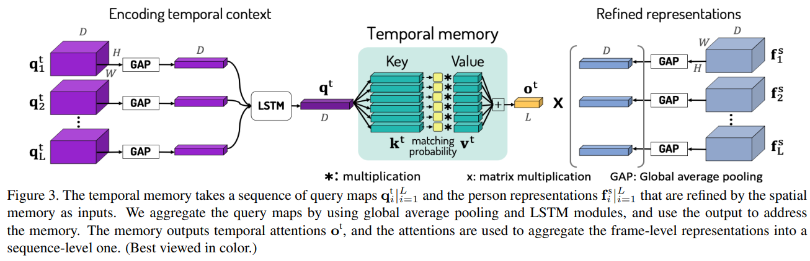
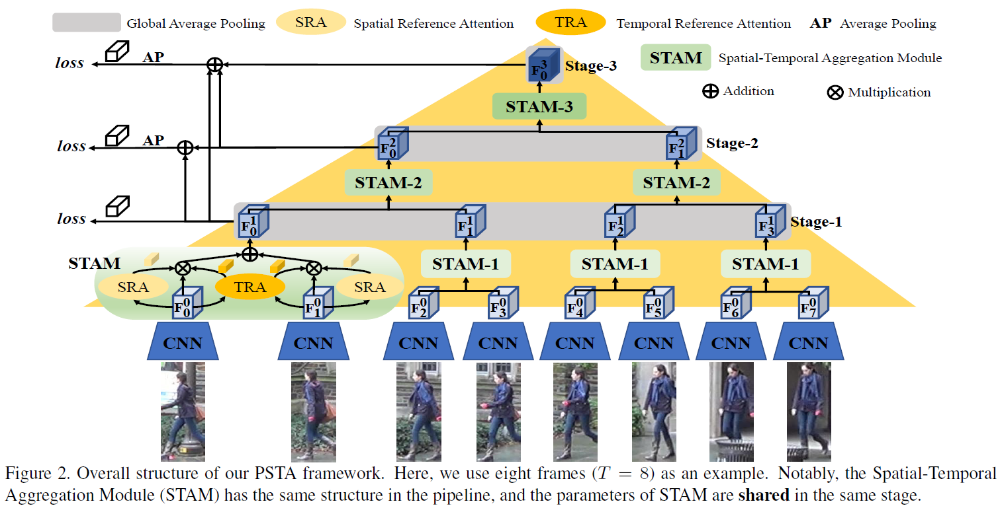
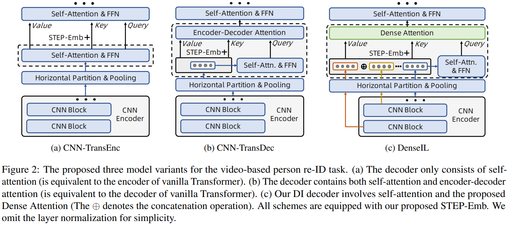
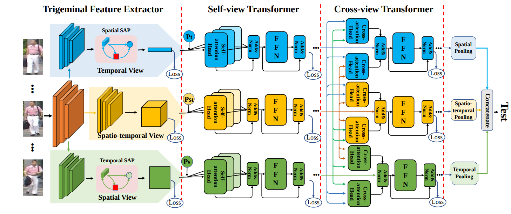

# 2021   

                             
|No.|Figure   |Title   |features | Results  |Pub.  |Links|BibTex|
|:-----:|:-----:|:-----:|:-----:|:------:|:---:|:------:|:-----:|
|1||__Watching You: Global-guided Reciprocal Learning for Video-based Person Re-identification__|Resnet50 + global correlation estimation + temporal reciprocating learning|PRID(Rank1=96.2%) iLIDS-VID(Rank1=90.4%) Mars(Rank1=91.0%,mAP=84.8%)|__CVPR2021__|[paper](https://openaccess.thecvf.com/content/CVPR2021/papers/Liu_Watching_You_Global-Guided_Reciprocal_Learning_for_Video-Based_Person_Re-Identification_CVPR_2021_paper.pdf) [code](https://github.com/flysnowtiger/GRL )|@inproceedings{liu2021watching,title={Watching You: Global-guided Reciprocal Learning for Video-based Person Re-identification}, author={Liu, Xuehu and Zhang, Pingping and Yu, Chenyang and Lu, Huchuan and Yang, Xiaoyun}, booktitle={Proceedings of the IEEE/CVF Conference on Computer Vision and Pattern Recognition}, pages={13334--13343}, year={2021}}|
|2||__BiCnet-TKS: Learning Efficient Spatial-Temporal Representation for Video Person Re-Identification__|Resnet50 + bilateral complementary network|DukeMTMC(Rank1=96.3%,mAP=96.1%) Mars(Rank1=90.2%,mAP=86.0%) LS-VID(Rank1=84.6%,mAP=75.1%)|__CVPR2021__|[paper](https://openaccess.thecvf.com/content/CVPR2021/papers/Hou_BiCnet-TKS_Learning_Efficient_Spatial-Temporal_Representation_for_Video_Person_Re-Identification_CVPR_2021_paper.pdf) [code](https://github.com/blue-blue272/BiCnet-TKS)|@inproceedings{hou2021bicnet, title={BiCnet-TKS: Learning Efficient Spatial-Temporal Representation for Video Person Re-Identification}, author={Hou, Ruibing and Chang, Hong and Ma, Bingpeng and Huang, Rui and Shan, Shiguang}, booktitle={Proceedings of the IEEE/CVF Conference on Computer Vision and Pattern Recognition}, pages={2014--2023}, year={2021} } |
|3||__Spatial-Temporal Correlation and Topology Learning for Person Re-Identification in Videos__|Resnet50 + key-points estimator + 3D graph layers|iLIDS_VID(Rank1=89.7%) Mars(Rank1=91.4%,mAP=86.7%)|__CVPR2021__|[paper](https://openaccess.thecvf.com/content/CVPR2021/papers/Liu_Spatial-Temporal_Correlation_and_Topology_Learning_for_Person_Re-Identification_in_Videos_CVPR_2021_paper.pdf)|@inproceedings{liu2021spatial, title={Spatial-Temporal Correlation and Topology Learning for Person Re-Identification in Videos}, author={Liu, Jiawei and Zha, Zheng-Jun and Wu, Wei and Zheng, Kecheng and Sun, Qibin}, booktitle={Proceedings of the IEEE/CVF Conference on Computer Vision and Pattern Recognition}, pages={4370--4379}, year={2021} } |
|4||__Spatio-Temporal Representation Factorization for Video-based Person Re-Identification__|Resnet50 + factorized attention|DukeMTMC(Rank1=97.4%,mAP=96.4%) Mars(Rank1=90.3%,mAP=86.1%) iLIDS-VID(Rank1=89.3%)|__ICCV2021__|[paper](https://arxiv.org/pdf/2107.11878.pdf)|@article{aich2021spatio, title={Spatio-Temporal Representation Factorization for Video-based Person Re-Identification}, author={Aich, Abhishek and Zheng, Meng and Karanam, Srikrishna and Chen, Terrence and Roy-Chowdhury, Amit K and Wu, Ziyan}, journal={arXiv preprint arXiv:2107.11878}, year={2021} } |
|5||__Video-based Person Re-identification with Spatial and Temporal Memory Networks__|Resnet50 + spatial-temporal memory|DukeMTMC(Rank1=97.0%,mAP=95.9%) Mars(Rank1=90.5%,mAP=84.5%) LS-VID(Rank1=82.1%,mAP=69.2%)|__ICCV2021__|[paper](https://arxiv.org/pdf/2108.09039.pdf)|@article{eom2021video, title={Video-based Person Re-identification with Spatial and Temporal Memory Networks}, author={Eom, Chanho and Lee, Geon and Lee, Junghyup and Ham, Bumsub}, journal={arXiv preprint arXiv:2108.09039}, year={2021} } |
|6||__Pyramid Spatial-Temporal Aggregation for Video-based Person Re-Identification__|Resnet50 + spatial-temporal aggregation|DukeMTMC(Rank1=98.3%,mAP=97.4%) Mars(Rank1=91.5%,mAP=85.8%) iLIDS-VID(Rank1=91.5%) PRID2011(Rank1=95.6%)|__ICCV2021__|[code](https://github.com/WangYQ9/VideoReID_PSTA)|TBD|
|7||__Dense Interaction Learning for Video-based Person Re-identification__|Resnet50 + transformer|iLIDS-VID(Rank1=92.0%) DukeMTMC(Rank1=97.6%,mAP=97.1%) Mars(Rank1=90.8%,mAP=87.0%) |__ICCV2021__|[paper](https://arxiv.org/pdf/2103.09013.pdf)|@article{he2021dense, title={Dense Interaction Learning for Video-based Person Re-identification}, author={He, Tianyu and Jin, Xin and Shen, Xu and Huang, Jianqiang and Chen, Zhibo and Hua, Xian-Sheng}, journal={arXiv preprint arXiv:2103.09013}, year={2021} } |
|8||__A Video Is Worth Three Views: Trigeminal Transformers for Video-based Person Re-identification__|Resnet50 + transformer|iLIDS-VID(Rank1=91.3%) PRID2011(Rank1=96.4%) Mars(Rank1=91.2%,mAP=85.8%) |__Arxiv2021__|[paper](https://arxiv.org/pdf/2104.01745.pdf)|@article{liu2021video,title={A Video Is Worth Three Views: Trigeminal Transformers for Video-based Person Re-identification},author={Liu, Xuehu and Zhang, Pingping and Yu, Chenyang and Lu, Huchuan and Qian, Xuesheng and Yang, Xiaoyun},journal={arXiv preprint arXiv:2104.01745},year={2021}}|

