# 2022  

                             
|No.|Figure   |Title   |features | Results  |Pub.  |Links|
|:-----:|:-----:|:-----:|:-----:|:---:|:---:|:------:|
|1|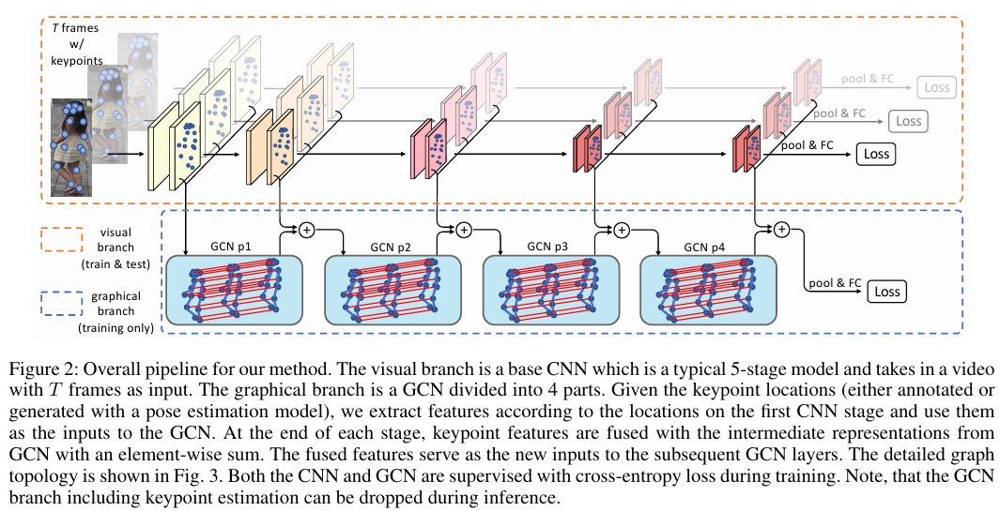|__Keypoint Message Passing for Video-Based Person Re-Identification__|Resnet50 + GCN|Mars(Rank1=92.0%,mAP=86.6%)|__AAAI2022__|[paper](https://arxiv.org/abs/2111.08279.pdf) [code](https://github.com/dichen-cd/KeypointMessagePassing)|
|2|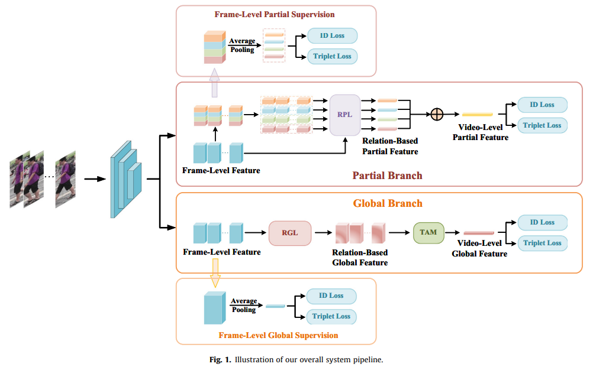|__Relation-based global-partial feature learning network for video-based person re-identification__|Resnet50 + Local-Global|DukeMTMC(Rank1=97.2%) iLIDS-VID(Rank1=88.7%) Mars(Rank1=89.1,mAP=84.5%)|__Neurocomputing2022__|[paper](https://www.sciencedirect.com/science/article/pii/S0925231222003010)|
|3|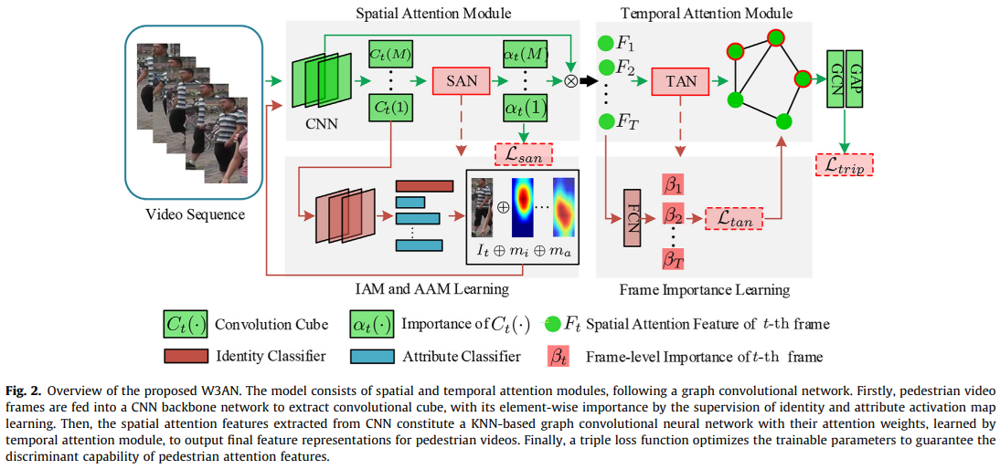|__What-Where-When Attention Network for video-based person re-identification__|Resnet50 + Spatial-Temporal Attention|iLIDS-VID(Rank1=89.2%) PRID(Rank1=95.8%) Mars(Rank1=91.1%,mAP=86.3%)|__IVC2022__|[paper](https://www.sciencedirect.com/science/article/pii/S092523122101496X)|
|4|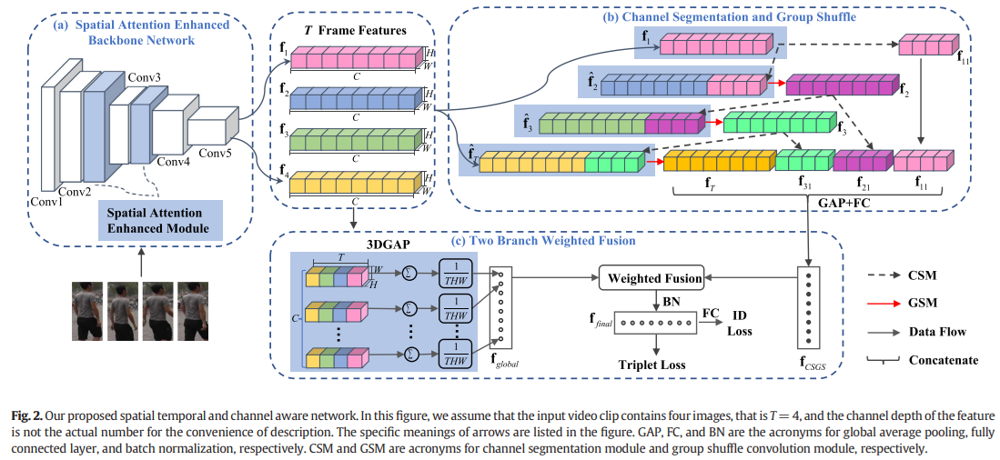|__Spatial temporal and channel aware network for video-based person re-identification__|Resnet50 + Spatial Attention|LSVID(Rank1=77.1%,mAP=66.2%) Mars(Rank1=88.9%,mAP=84.5%)|__IVC2022__|[paper](https://www.sciencedirect.com/science/article/pii/S0262885621002614)|
|5|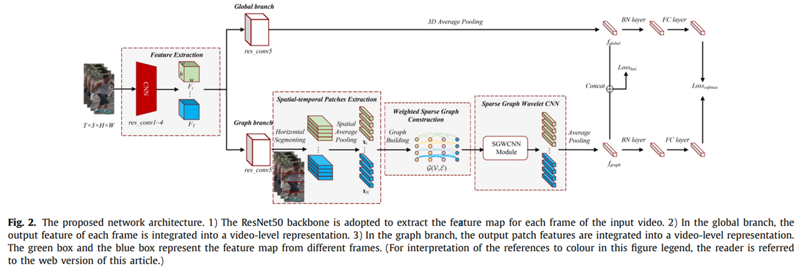|__A sparse graph wavelet convolution neural network for video-based person re-identification__|Resnet50 + GNN|DukeMTMC(Rank1=96.3%,mAP=95.9%) Mars(Rank1=90.0%,mAP=85.7%) iLIDS-VID(Rank1=87.8%) |__PR2022__|[paper](https://www.sciencedirect.com/science/article/pii/S0031320322001893)|
|6|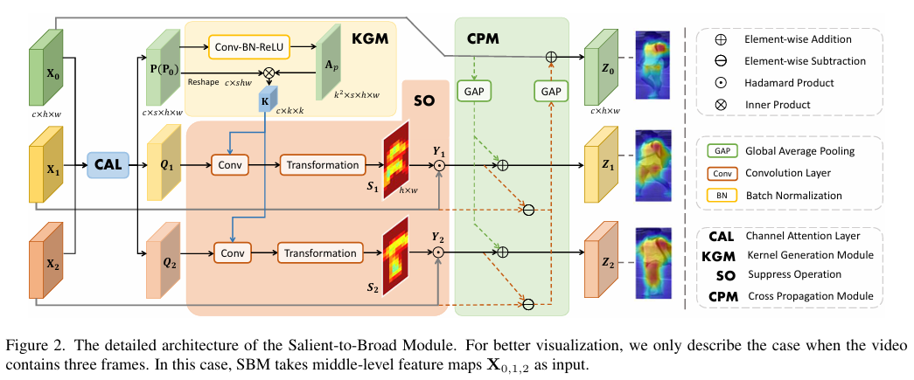|__Salient-to-Broad Transition for Video Person Re-identification__|Resnet50 + Attention| iLIDS-VID(Rank1=92.5%) PRID(Rank1=96.5%) Mars(Rank1=91.0%,mAP=86.2%) LSVID(Rank1=87.4%,mAP=79.6%)|__CVPR2022__|[paper](https://ieeexplore.ieee.org/document/9880285) [code](https://github.com/baist/SINet)|
|7|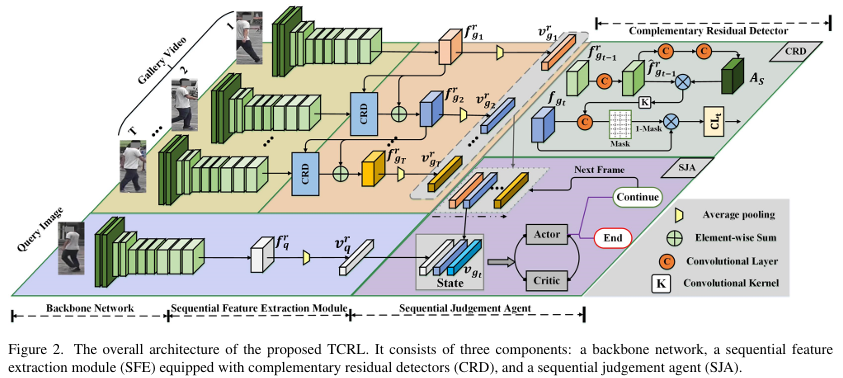|__Temporal Complementarity-Guided Reinforcement Learning for Image-to-Video Person Re-Identification__|Resnet50 |iLIDS-VID(Rank1=77.3%) Mars(Rank1=86.0%,mAP=80.1%) |__CVPR2022__|[paper](https://ieeexplore.ieee.org/document/9880409)|
|8|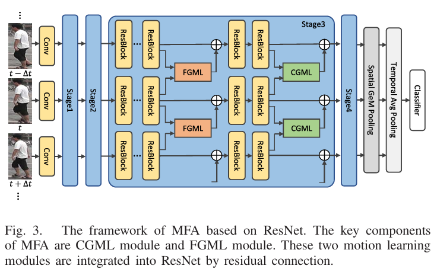|__Motion Feature Aggregation for Video-Based Person Re-Identification__|Resnet50| LSVID(Rank1=88.2%,mAP=78.9%) Mars(Rank1=90.4%,mAP=85.0%) iLIDS-VID(Rank1=93.3%) PRID(Rank1=95.5%) |__TIP2022__|[paper](https://ieeexplore.ieee.org/document/9784400) [code](https://github.com/guxinqian/SimpleReID)|
|9|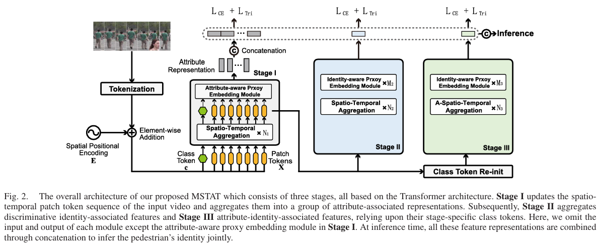|__Multi-Stage Spatio-Temporal Aggregation Transformer for Video Person Re-Identification__|Pure Transformer | iLIDS-VID(Rank1=93.3%) Mars(Rank1=91.8%,mAP=85.3%) DukeMTMC(Rank1=97.4%,mAP=96.4%) |__TMM2022__|[paper](https://ieeexplore.ieee.org/abstract/document/9996153) |
|10|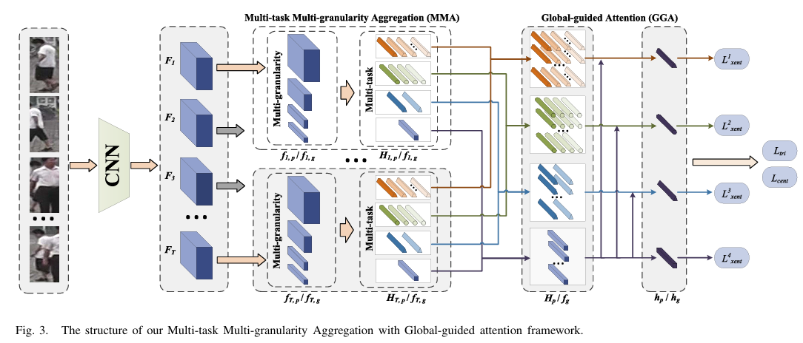|__Multitask Multigranularity Aggregation With Global-Guided Attention for Video Person Re-Identification__|Resnet50 + Multi-grained Multi-Attention | iLIDS-VID(Rank1=87.7%) Mars(Rank1=91.0%,mAP=85.4%) |__TCSVT2022__|[paper](https://ieeexplore.ieee.org/document/9795316) |
|11|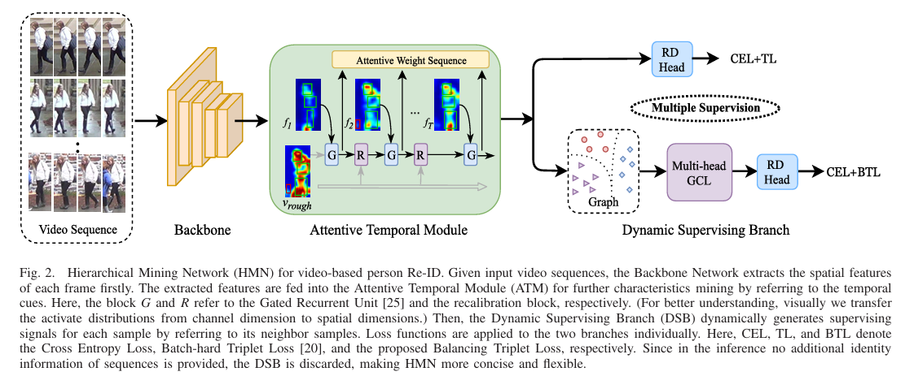|__Robust Video-Based Person Re-Identification by Hierarchical Mining__|Resnet50 + Attention | DukeMTMC(Rank1=96.3%, mAP=95.1%) Mars(Rank1=88.5%,mAP=82.6%) |__TCSVT2022__|[paper](https://ieeexplore.ieee.org/document/9416694) |
|12|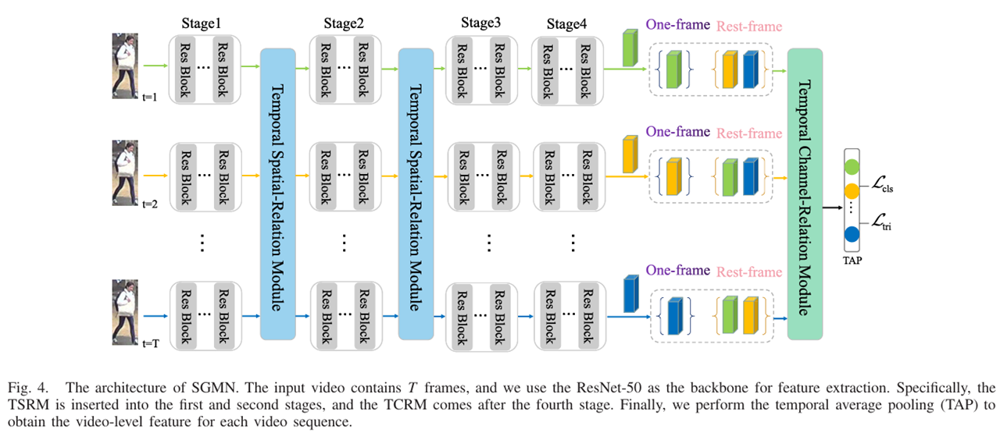|__Saliency and Granularity: Discovering Temporal Coherence for Video-Based Person Re-Identification__|Resnet50 + Attention | iLIDS-VID(Rank1=88.7%) Mars(Rank1=90.8%,mAP=85.3%)  DukeMYMC(Rank1=96.9%,mAP=96.3%)  LSVID(Rank1=82.8%,mAP=73.2%) |__TCSVT2022__|[paper](https://ieeexplore.ieee.org/document/9729212) |
|13|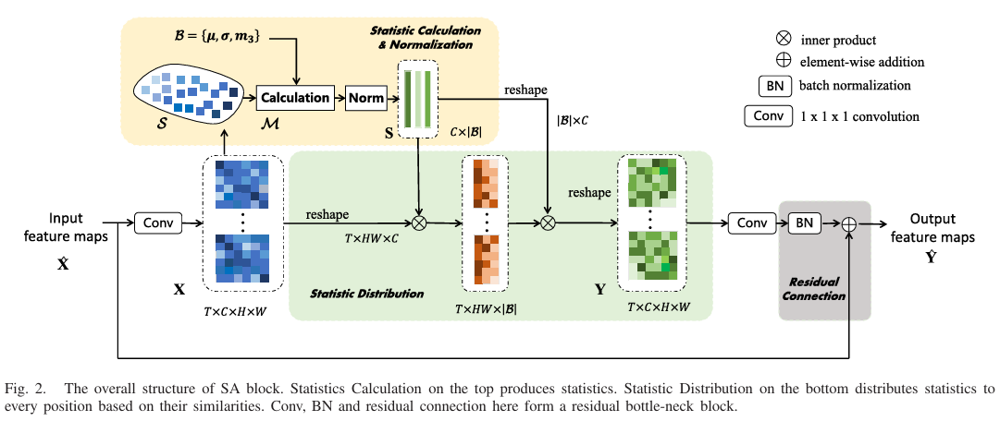|__SANet: Statistic Attention Network for Video-Based Person Re-Identification__|Resnet50 + Attention | DukeMTMC(Rank1=97.7%, mAP=96.7%) Mars(Rank1=91.2%,mAP=86.0%) |__TCSVT2022__|[paper](https://ieeexplore.ieee.org/document/9570321) |
|14|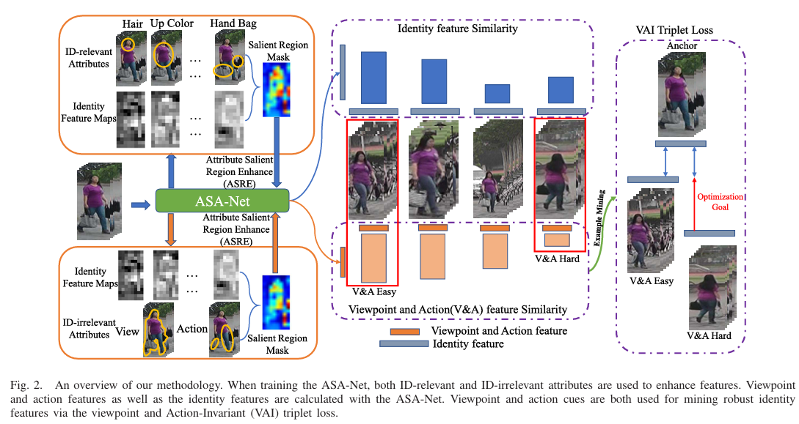|__Video Person Re-Identification Using Attribute-Enhanced Features__|Resnet50 + Attribute | DukeMTMC(Rank1=97.6%, mAP=97.1) Mars(Rank1=91.1%,mAP=86.0%) |__TCSVT2022__|[paper](https://ieeexplore.ieee.org/document/9817378) |
|15|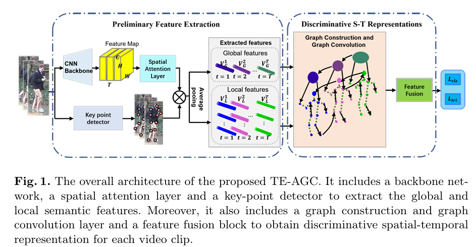|__Temporal Extension Topology Learning for Video-based Person Re-Identification__|Resnet50 + GNN | DukeMTMC(Rank1=97.2%, mAP=96.3%) Mars(Rank1=90.7%,mAP=85.8%) |__ACCV2022__|[paper](https://openaccess.thecvf.com/content/ACCV2022W/MLCSA/papers/Ning_Temporal_Extension_Topology_Learning_for_Video-based_Person_Re-Identification_ACCVW_2022_paper.pdf) |
|16|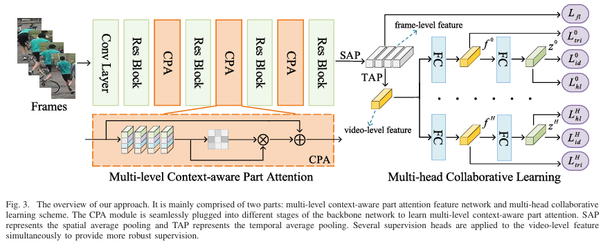|__Person Re-Identification by Context-Aware Part Attention and Multi-Head Collaborative Learning__|Resnet50 + Multi-grained Multi-Attention | DukeMTMC(Rank1=96.6%,mAP=95.8%) Mars(Rank1=88.2%,mAP=84.1%) iLIDS-VID(Rank1=85.8%) PRID(Rank1=92.2%) |__TIFS2022__|[paper](https://ieeexplore.ieee.org/document/9416422) |